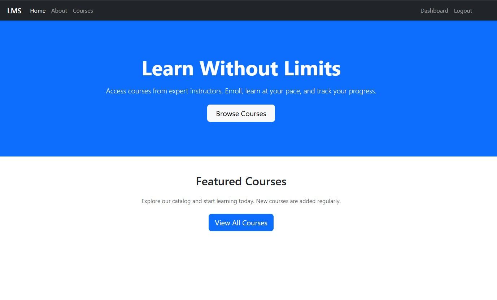
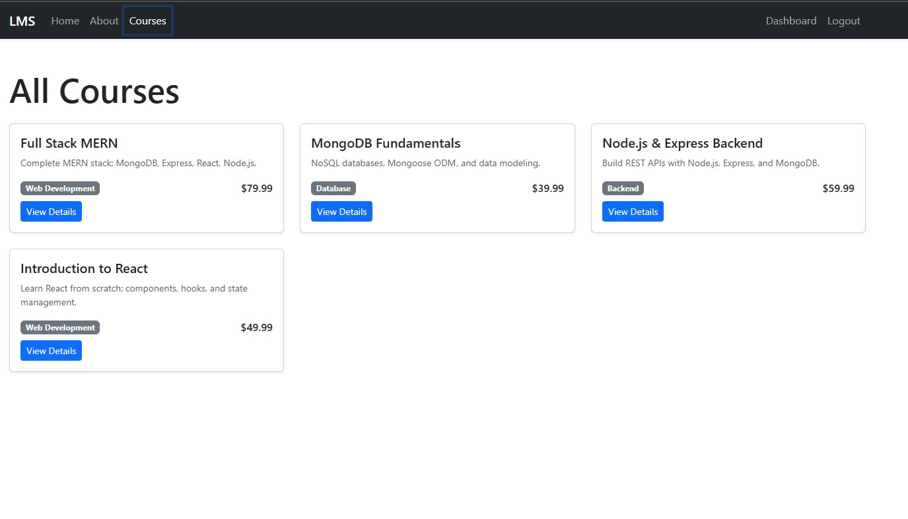
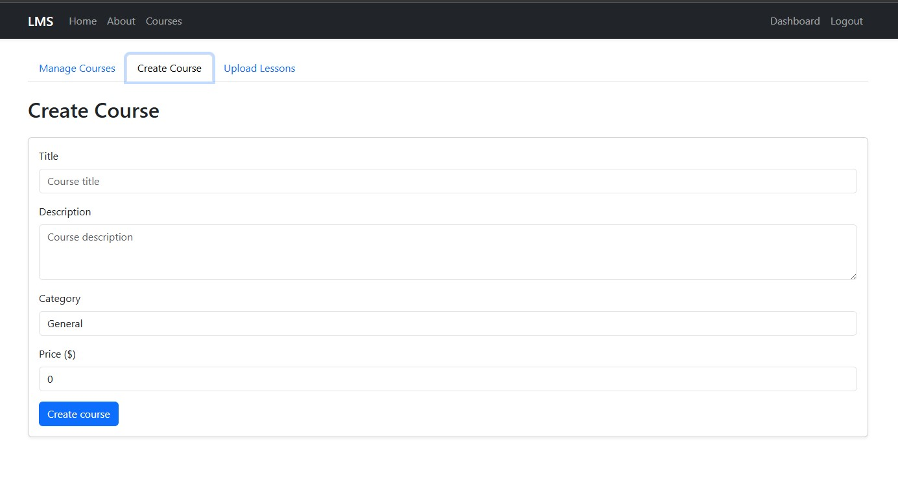
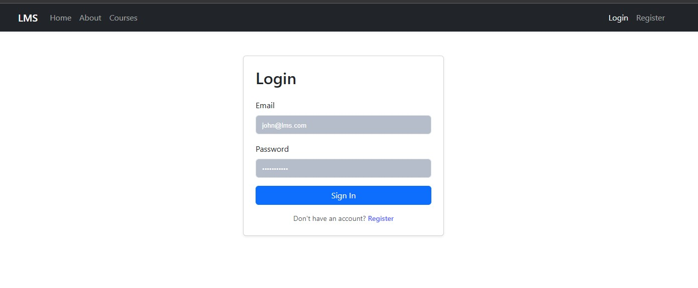
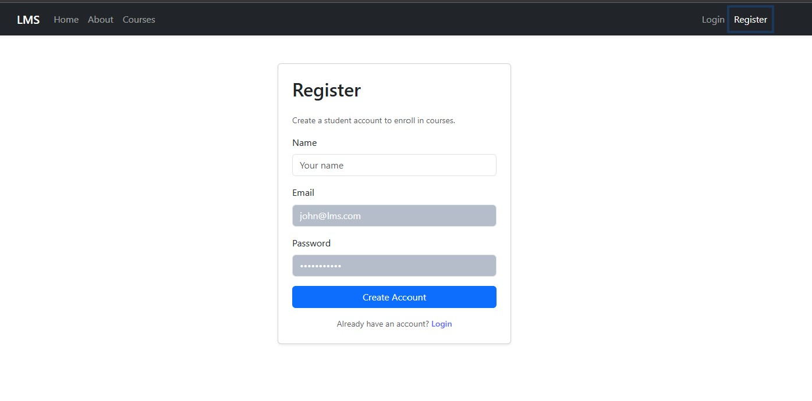
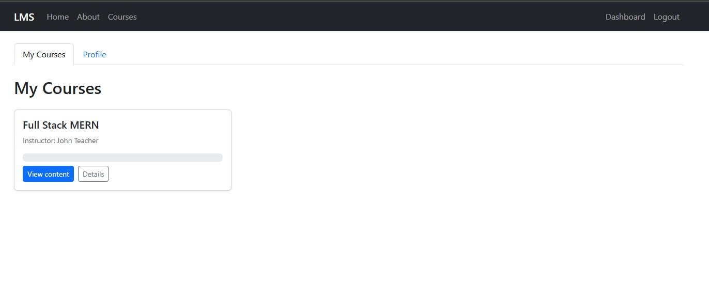
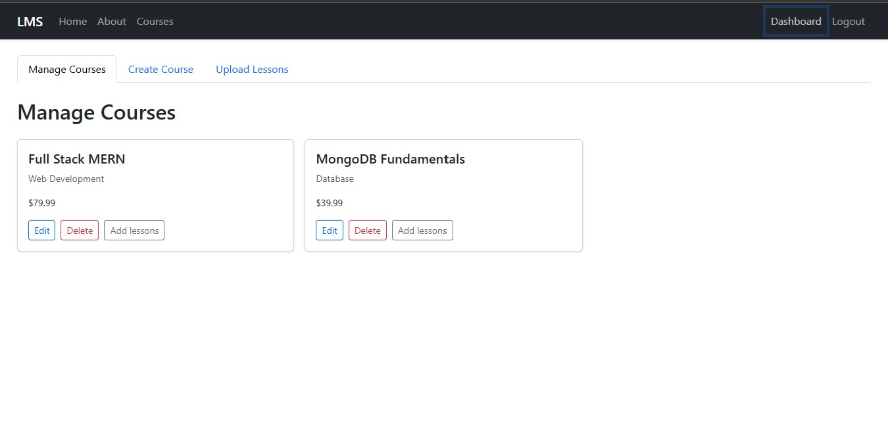

# MERN Stack Learning Management System (LMS)

A full-stack Learning Management System built with the MERN stack (MongoDB, Express, React, Node.js). Users can browse courses, enroll as students, create and manage courses as instructors, and manage the platform as admins.

## Tech Stack

- **Frontend:** React 19, Vite, React Router, React Bootstrap, Axios
- **Backend:** Node.js, Express 5, Mongoose
- **Database:** MongoDB
- **Auth:** JWT (jsonwebtoken), bcryptjs
- **Validation:** express-validator

## Features

- **Public:** Home, About, Course listing, Course detail, Login, Register
- **Student:** My Courses, Profile, Enroll in courses, View lessons
- **Instructor:** Create course, Manage courses, Edit course, Upload lessons
- **Admin:** Manage users, Manage all courses, Reports / Analytics

## Installation

### Prerequisites

- Node.js (v18+)
- MongoDB (local or MongoDB Atlas connection string)
- Git

### 1. Clone the repository

```bash
git clone https://github.com/haider8278/mernstack-final-project-haider-ali.git
cd "mernstack-final-project-haider-ali"
```

### 2. Backend setup

```bash
cd backend
npm install
```

Create a `.env` file in `backend/` (copy from `.env.example`):

```env
PORT=5000
MONGODB_URI=mongodb://localhost:27017/lms
JWT_SECRET=your-super-secret-jwt-key-change-in-production
JWT_EXPIRE=7d
NODE_ENV=development
```

For MongoDB Atlas, set `MONGODB_URI` to your Atlas connection string.

Start the backend:

```bash
npm start
```

The API runs at `http://localhost:5000`. Health check: `GET http://localhost:5000/api/health`

### 3. Frontend setup

Open a new terminal:

```bash
cd frontend
npm install
```

Create a `.env` file in `frontend/` (copy from `.env.example`):

```env
VITE_API_URL=http://localhost:5000/api
```

Start the frontend:

```bash
npm run dev
```

The app runs at `http://localhost:5173` (or the port Vite shows). Use this URL for local development; for production build, set `VITE_API_URL` to your deployed backend URL.

### 4. Build frontend for production

```bash
cd frontend
npm run build
```

Output is in `frontend/dist/`. Serve with any static host or use `npm run preview` to test locally.

---

## Deployment

### Backend (Render, Railway, or similar)

1. **MongoDB:** Create a database on [MongoDB Atlas](https://www.mongodb.com/atlas), get the connection string.
2. **Host:** Create a new Web Service (Render) or project (Railway).
3. **Build & start:**
   - **Root:** `backend` (or set root to backend folder).
   - **Build command:** `npm install`
   - **Start command:** `npm start`
4. **Environment variables:** Set in the host dashboard:
   - `PORT` (often provided by host)
   - `MONGODB_URI` = your Atlas connection string
   - `JWT_SECRET` = a long random string (e.g. from `openssl rand -hex 32`)
   - `JWT_EXPIRE` = `7d`
   - `NODE_ENV` = `production`
5. Deploy and note the backend URL (e.g. `https://your-app.onrender.com`).

**Optional – Render:** A `render.yaml` is included in the repo for backend deploy; you can use “New → Blueprint” and point to this repo.

### Frontend (Vercel or Netlify)

1. **Build:** Connect your Git repo; set **Root directory** to `frontend`.
2. **Build command:** `npm run build`
3. **Publish directory:** `dist`
4. **Environment variable:** Add `VITE_API_URL` = your deployed backend API URL including `/api` (e.g. `https://your-app.onrender.com/api`).
5. Deploy. The site will use this API URL in production.

### Deployment links (fill after deploy)

- **Backend API:** _e.g. https://your-lms-api.vercel.app_
- **Frontend:** _e.g. https://your-lms.vercel.app_

---

## Screenshots

Add screenshots here after deployment or from local run:

**Home:**



**Course Listing:**



**Create Course:**



**Login:**



**Register:**



**Student Dashboard:**



**Instructor Dashboard:**



**Admin Dashboard:**


---

## API overview

- `POST /api/auth/register` – Register (student)
- `POST /api/auth/login` – Login
- `GET /api/courses` – List courses (optional query: `category`)
- `GET /api/courses/:id` – Course detail
- `POST /api/courses` – Create course (instructor/admin)
- `PUT /api/courses/:id` – Update course (owner/admin)
- `DELETE /api/courses/:id` – Delete course (owner/admin)
- `GET /api/courses/:id/lessons` – Get lessons (enrolled or instructor/admin)
- `POST /api/courses/:id/lessons` – Add lesson (instructor/admin)
- `POST /api/enroll` – Enroll (student, body: `courseId`)
- `GET /api/my-courses` – My enrollments (student)
- `GET /api/users/me`, `PUT /api/users/me` – Current user (auth)
- `GET /api/users` – All users (admin)
- `DELETE /api/users/:id` – Delete user (admin)
- `GET /api/admin/analytics` – Analytics (admin)

All protected routes require header: `Authorization: Bearer <token>`.

---
